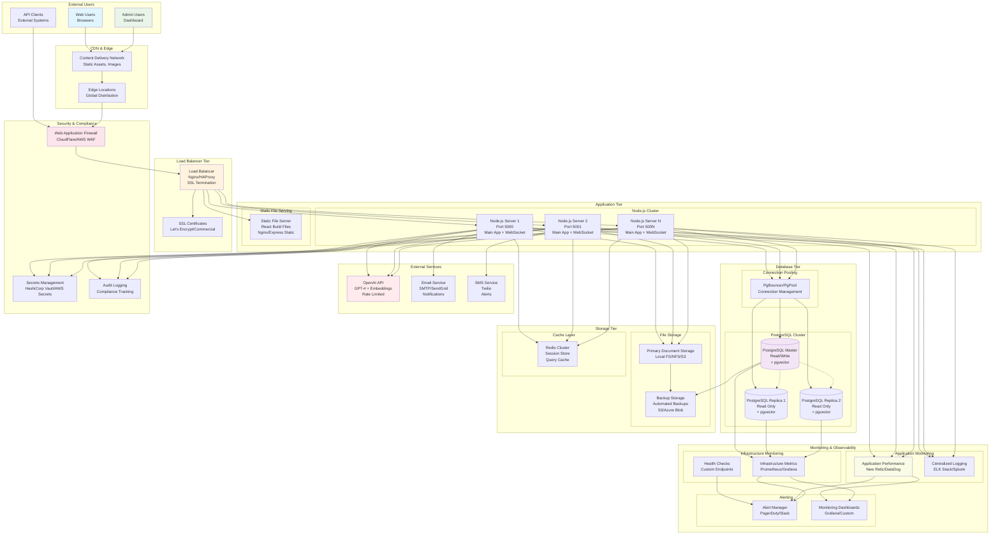
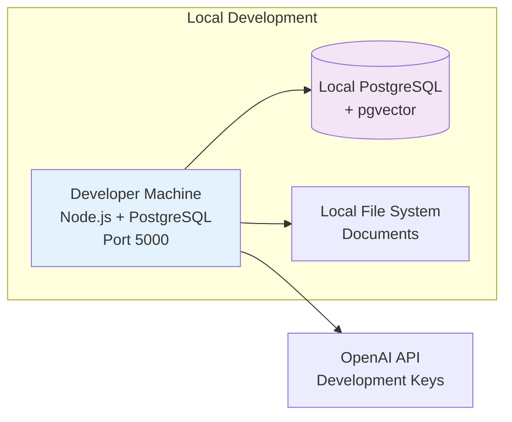
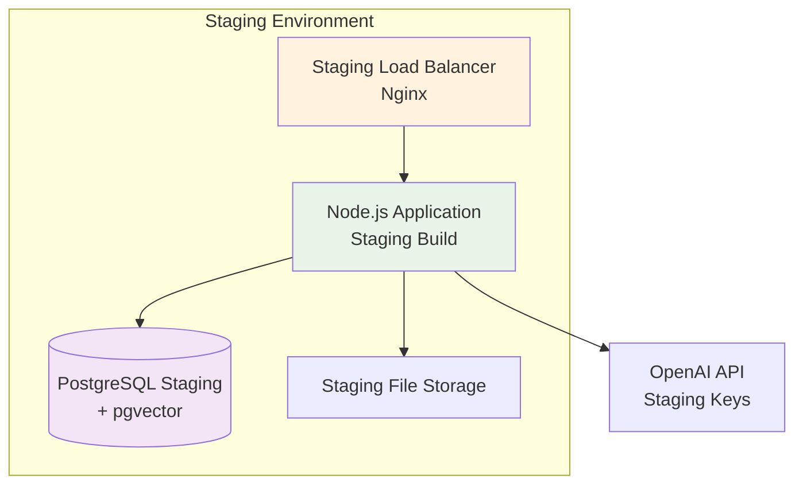
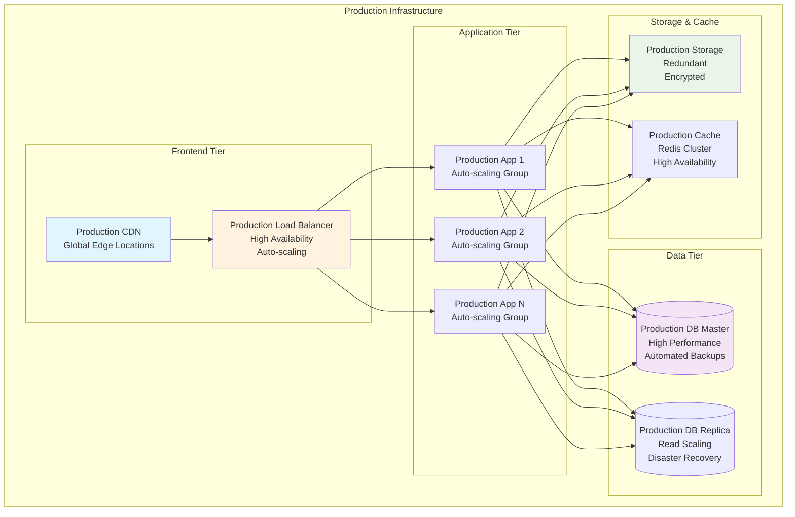
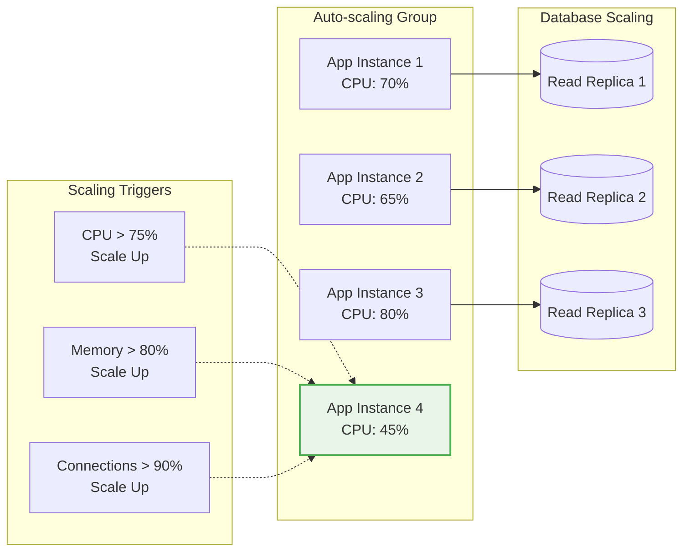
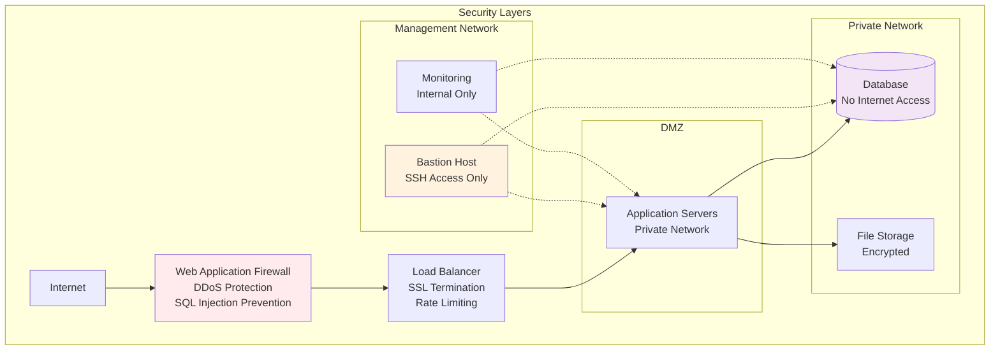
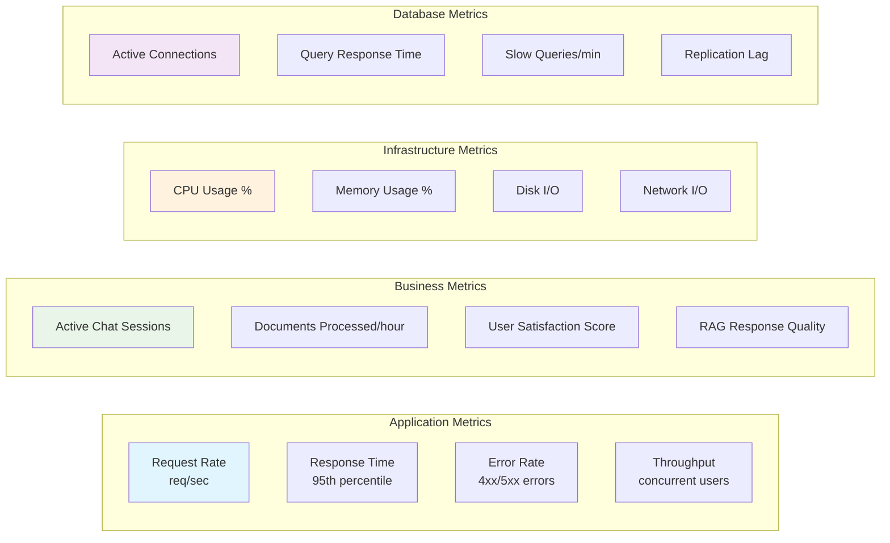
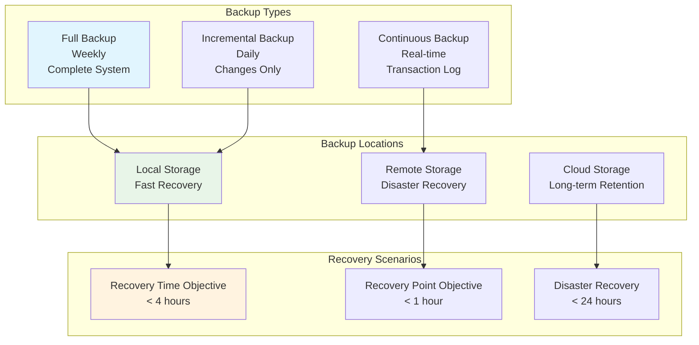

# Fund Management Chatbot - Deployment Architecture

## Production Deployment Overview

This document outlines the production deployment architecture for the Fund Management Chatbot, including infrastructure components, scaling strategies, and operational considerations.

## Deployment Architecture Diagram



## Deployment Environments

### Development Environment


### Staging Environment


### Production Environment (Detailed)


## Infrastructure Components

### Load Balancer Configuration
```nginx
# Nginx Configuration Example
upstream chatbot_backend {
    least_conn;
    server 127.0.0.1:5000 max_fails=3 fail_timeout=30s;
    server 127.0.0.1:5001 max_fails=3 fail_timeout=30s;
    server 127.0.0.1:5002 max_fails=3 fail_timeout=30s;
}

server {
    listen 443 ssl http2;
    server_name chatbot.company.com;
    
    ssl_certificate /path/to/ssl/cert.pem;
    ssl_certificate_key /path/to/ssl/key.pem;
    
    # Security headers
    add_header X-Frame-Options DENY;
    add_header X-Content-Type-Options nosniff;
    add_header X-XSS-Protection "1; mode=block";
    
    # Static files
    location /static/ {
        root /var/www/chatbot/client/build;
        expires 1y;
        add_header Cache-Control "public, immutable";
    }
    
    # API routes
    location /api/ {
        proxy_pass http://chatbot_backend;
        proxy_http_version 1.1;
        proxy_set_header Upgrade $http_upgrade;
        proxy_set_header Connection 'upgrade';
        proxy_set_header Host $host;
        proxy_set_header X-Real-IP $remote_addr;
        proxy_set_header X-Forwarded-For $proxy_add_x_forwarded_for;
        proxy_set_header X-Forwarded-Proto $scheme;
        proxy_cache_bypass $http_upgrade;
    }
    
    # WebSocket
    location /ws {
        proxy_pass http://chatbot_backend;
        proxy_http_version 1.1;
        proxy_set_header Upgrade $http_upgrade;
        proxy_set_header Connection "upgrade";
        proxy_set_header Host $host;
        proxy_read_timeout 86400;
    }
    
    # React app
    location / {
        try_files $uri $uri/ /index.html;
        root /var/www/chatbot/client/build;
    }
}
```

### Database Configuration
```sql
-- PostgreSQL Configuration for Production
-- postgresql.conf settings

# Connection Settings
max_connections = 200
shared_buffers = 256MB
effective_cache_size = 1GB
maintenance_work_mem = 64MB
checkpoint_completion_target = 0.9
wal_buffers = 16MB
default_statistics_target = 100
random_page_cost = 1.1
effective_io_concurrency = 200

# pgvector specific settings
shared_preload_libraries = 'vector'

# Logging
log_destination = 'stderr'
logging_collector = on
log_directory = 'pg_log'
log_filename = 'postgresql-%Y-%m-%d_%H%M%S.log'
log_statement = 'mod'
log_min_duration_statement = 1000

# Replication (for read replicas)
wal_level = replica
max_wal_senders = 3
wal_keep_segments = 32
```

### Application Process Management
```javascript
// PM2 Ecosystem Configuration
module.exports = {
  apps: [{
    name: 'chatbot-app-1',
    script: 'server.js',
    instances: 1,
    exec_mode: 'cluster',
    env: {
      NODE_ENV: 'production',
      PORT: 5000,
      DB_POOL_SIZE: 20
    },
    error_file: './logs/app-1-err.log',
    out_file: './logs/app-1-out.log',
    log_file: './logs/app-1-combined.log',
    time: true
  }, {
    name: 'chatbot-app-2',
    script: 'server.js',
    instances: 1,
    exec_mode: 'cluster',
    env: {
      NODE_ENV: 'production',
      PORT: 5001,
      DB_POOL_SIZE: 20
    },
    error_file: './logs/app-2-err.log',
    out_file: './logs/app-2-out.log',
    log_file: './logs/app-2-combined.log',
    time: true
  }]
};
```

## Scaling Strategies

### Horizontal Scaling


### Vertical Scaling
- **CPU**: Scale up during peak hours
- **Memory**: Increase for large document processing
- **Storage**: Expand as knowledge base grows
- **Network**: Upgrade bandwidth for high traffic

## Security Architecture

### Network Security


### Data Encryption
- **At Rest**: Database encryption, file system encryption
- **In Transit**: TLS 1.3, encrypted API communications
- **Application Level**: Sensitive data encryption in services

## Monitoring & Observability

### Application Metrics


### Health Check Endpoints
```javascript
// Health Check Implementation
app.get('/health', async (req, res) => {
  const health = {
    status: 'healthy',
    timestamp: new Date().toISOString(),
    uptime: process.uptime(),
    checks: {
      database: await checkDatabase(),
      redis: await checkRedis(),
      openai: await checkOpenAI(),
      fileSystem: await checkFileSystem(),
      memory: checkMemoryUsage(),
      cpu: checkCPUUsage()
    }
  };
  
  const isHealthy = Object.values(health.checks)
    .every(check => check.status === 'healthy');
  
  res.status(isHealthy ? 200 : 503).json(health);
});
```

## Disaster Recovery

### Backup Strategy


### Failover Strategy
- **Database**: Automatic failover to read replica
- **Application**: Load balancer health checks
- **Storage**: Redundant storage with automatic failover
- **Network**: Multiple availability zones

## Deployment Process

### CI/CD Pipeline

```mermaid
graph LR
    subgraph "Development"
        CODE[Code Commit<br/>Git Repository]
        PR[Pull Request<br/>Code Review]
    end
    
    subgraph "CI Pipeline"
        BUILD[Build<br/>npm install<br/>TypeScript compile]
        TEST[Test<br/>Unit + Integration<br/>Security Scan]
        PACKAGE[Package<br/>Docker Image<br/>Artifacts]
    end
    
    subgraph "CD Pipeline"
        STAGE[Deploy to Staging<br/>Automated Testing]
        PROD_APPROVAL[Production Approval<br/>Manual Gate]
        PROD_DEPLOY[Production Deployment<br/>Blue-Green/Rolling]
    end
    
    subgraph "Post-Deployment"
        MONITOR[Monitoring<br/>Health Checks]
        ROLLBACK[Rollback<br/>If Issues Detected]
    end
    
    CODE --> PR
    PR --> BUILD
    BUILD --> TEST
    TEST --> PACKAGE
    PACKAGE --> STAGE
    STAGE --> PROD_APPROVAL
    PROD_APPROVAL --> PROD_DEPLOY
    PROD_DEPLOY --> MONITOR
    MONITOR --> ROLLBACK
    
    style BUILD fill:#e1f5fe
    style TEST fill:#e8f5e8
    style PROD_DEPLOY fill:#fff3e0
    style MONITOR fill:#f3e5f5
```


## Performance Optimization

### Caching Strategy
- **Application Cache**: Redis for session data and query results
- **Database Cache**: Query result caching and connection pooling
- **CDN Cache**: Static assets with long TTL
- **Browser Cache**: Client-side caching for UI components

### Database Optimization
- **Indexing**: Optimized indexes for vector search and queries
- **Partitioning**: Table partitioning for large datasets
- **Connection Pooling**: Efficient connection management
- **Read Replicas**: Distribute read load across replicas

This deployment architecture provides a robust, scalable, and secure foundation for production deployment of the Fund Management Chatbot system.
