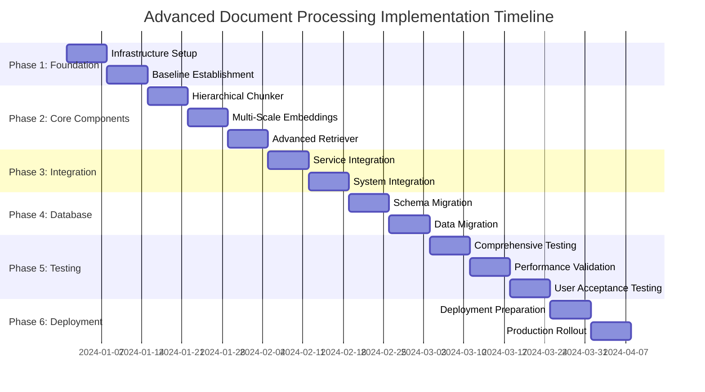

# Advanced Document Processing - Multiphase Implementation Plan

## 🎯 **EXECUTIVE SUMMARY**

This multiphase implementation plan provides a **systematic, risk-mitigated approach** to deploying the advanced document processing system. The plan is structured to ensure **zero downtime**, **continuous validation**, and **incremental value delivery** while maintaining the "no shortcuts, no fallbacks, clean code" philosophy.

**Total Timeline**: 8-12 weeks  
**Phases**: 6 distinct phases  
**Approach**: Incremental deployment with continuous validation  

---

## 📋 **PHASE OVERVIEW**

| Phase | Duration | Focus | Risk Level | Deliverables |
|-------|----------|-------|------------|--------------|
| **Phase 1** | 1-2 weeks | Foundation & Preparation | Low | Infrastructure, Testing Framework |
| **Phase 2** | 2-3 weeks | Core Components Development | Medium | Chunking, Embedding, Retrieval Modules |
| **Phase 3** | 1-2 weeks | Integration & Orchestration | Medium | Service Integration, Pipeline Setup |
| **Phase 4** | 1-2 weeks | Database & Schema Updates | High | Schema Migration, Data Integrity |
| **Phase 5** | 2-3 weeks | Testing & Validation | Medium | Comprehensive Testing, Performance Validation |
| **Phase 6** | 1-2 weeks | Production Deployment | High | Live Deployment, Monitoring, Optimization |

---

## 🚀 **PHASE 1: FOUNDATION & PREPARATION**
**Duration**: 1-2 weeks  
**Risk Level**: Low  
**Team**: DevOps, Backend Developers

### **Objectives**
- Establish robust testing framework
- Set up monitoring and logging infrastructure
- Prepare development and staging environments
- Create backup and rollback procedures

### **Detailed Tasks**

#### **Week 1: Infrastructure Setup**
```bash
# Day 1-2: Environment Preparation
□ Set up dedicated staging environment
□ Configure advanced logging infrastructure
□ Implement comprehensive monitoring dashboards
□ Set up automated backup procedures

# Day 3-4: Testing Framework
□ Create advanced testing framework
□ Implement performance benchmarking tools
□ Set up automated quality validation
□ Configure continuous integration pipeline

# Day 5: Documentation & Standards
□ Establish code quality standards
□ Create deployment procedures documentation
□ Set up change management processes
□ Define rollback procedures
```

#### **Week 2: Baseline Establishment**
```bash
# Day 1-3: Current System Analysis
□ Document current system performance metrics
□ Create baseline performance benchmarks
□ Identify critical system dependencies
□ Map existing data flow and processing pipeline

# Day 4-5: Risk Assessment & Mitigation
□ Conduct comprehensive risk assessment
□ Create detailed mitigation strategies
□ Establish emergency procedures
□ Set up monitoring alerts and thresholds
```

### **Deliverables**
- ✅ Staging environment with advanced monitoring
- ✅ Comprehensive testing framework
- ✅ Baseline performance metrics
- ✅ Risk mitigation procedures
- ✅ Automated backup and rollback systems

### **Success Criteria**
- All monitoring systems operational
- Testing framework validates current system
- Baseline metrics established and documented
- Emergency procedures tested and validated

---

## 🔧 **PHASE 2: CORE COMPONENTS DEVELOPMENT**
**Duration**: 2-3 weeks  
**Risk Level**: Medium  
**Team**: Senior Backend Developers, AI/ML Engineers

### **Objectives**
- Implement hierarchical semantic chunking
- Develop multi-scale embedding generation
- Create advanced contextual retrieval system
- Ensure all components meet quality standards

### **Detailed Tasks**

#### **Week 1: Hierarchical Semantic Chunker**
```javascript
// Day 1-2: Core Chunking Logic
□ Implement HierarchicalSemanticChunker class
□ Develop semantic boundary detection algorithms
□ Create adaptive chunking mechanisms
□ Implement quality scoring system

// Day 3-4: Context Preservation
□ Develop hierarchical overlap mechanisms
□ Implement parent-child relationship tracking
□ Create cross-reference preservation system
□ Add narrative flow detection

// Day 5: Testing & Validation
□ Create comprehensive unit tests
□ Implement integration tests
□ Validate chunking quality metrics
□ Performance optimization and tuning
```

#### **Week 2: Multi-Scale Embedding Generator**
```javascript
// Day 1-2: Core Embedding Logic
□ Implement MultiScaleEmbeddingGenerator class
□ Develop content embedding generation
□ Create contextual embedding mechanisms
□ Implement hierarchical embedding system

// Day 3-4: Advanced Features
□ Add semantic embedding generation
□ Implement domain-specific optimization
□ Create embedding quality validation
□ Add caching and performance optimization

// Day 5: Testing & Integration
□ Create comprehensive test suite
□ Validate embedding quality and consistency
□ Test domain optimization features
□ Performance benchmarking and optimization
```

#### **Week 3: Advanced Contextual Retriever**
```javascript
// Day 1-2: Core Retrieval Logic
□ Implement AdvancedContextualRetriever class
□ Develop multi-strategy retrieval system
□ Create context expansion mechanisms
□ Implement query analysis and routing

// Day 3-4: Advanced Features
□ Add "lost in middle" mitigation
□ Implement multi-hop reasoning
□ Create quality optimization algorithms
□ Add strategic reordering mechanisms

// Day 5: Testing & Optimization
□ Create comprehensive test suite
□ Validate retrieval quality and performance
□ Test context expansion features
□ Performance optimization and tuning
```

### **Deliverables**
- ✅ HierarchicalSemanticChunker with full test coverage
- ✅ MultiScaleEmbeddingGenerator with quality validation
- ✅ AdvancedContextualRetriever with performance optimization
- ✅ Comprehensive unit and integration tests
- ✅ Performance benchmarks for all components

### **Success Criteria**
- All components pass comprehensive test suites
- Performance meets or exceeds baseline requirements
- Code quality standards maintained (100% test coverage)
- Components integrate seamlessly with existing system

---

## 🔗 **PHASE 3: INTEGRATION & ORCHESTRATION**
**Duration**: 1-2 weeks  
**Risk Level**: Medium  
**Team**: Backend Developers, System Architects

### **Objectives**
- Create orchestration service
- Integrate components into unified pipeline
- Implement quality validation and monitoring
- Ensure seamless system integration

### **Detailed Tasks**

#### **Week 1: Service Integration**
```javascript
// Day 1-2: Orchestration Service
□ Implement AdvancedDocumentProcessingService
□ Create end-to-end processing pipeline
□ Implement batch processing capabilities
□ Add comprehensive error handling

// Day 3-4: Quality Validation
□ Implement quality validation framework
□ Create processing statistics tracking
□ Add performance monitoring hooks
□ Implement audit logging system

// Day 5: Integration Testing
□ Test complete processing pipeline
□ Validate component interactions
□ Test error handling and recovery
□ Performance testing and optimization
```

#### **Week 2: System Integration**
```javascript
// Day 1-2: RAG Service Integration
□ Update RAGChatService to use new components
□ Implement backward compatibility layer
□ Create feature flag system for gradual rollout
□ Add comprehensive logging and monitoring

// Day 3-4: API Integration
□ Update document processing endpoints
□ Implement new configuration options
□ Create health check endpoints
□ Add performance metrics endpoints

// Day 5: End-to-End Testing
□ Test complete system integration
□ Validate API functionality
□ Test configuration management
□ Performance and load testing
```

### **Deliverables**
- ✅ AdvancedDocumentProcessingService with full orchestration
- ✅ Updated RAGChatService with new components
- ✅ Feature flag system for controlled rollout
- ✅ Comprehensive integration tests
- ✅ Performance monitoring and metrics

### **Success Criteria**
- Complete pipeline processes documents successfully
- All integration tests pass
- Performance meets baseline requirements
- System maintains backward compatibility

---

## 🗄️ **PHASE 4: DATABASE & SCHEMA UPDATES**
**Duration**: 1-2 weeks  
**Risk Level**: High  
**Team**: Database Administrators, Backend Developers

### **Objectives**
- Update database schema for hierarchical relationships
- Migrate existing data safely
- Implement new indexing strategies
- Ensure data integrity and performance

### **Detailed Tasks**

#### **Week 1: Schema Design & Migration**
```sql
-- Day 1-2: Schema Updates
□ Design hierarchical relationship schema
□ Create migration scripts with rollback procedures
□ Implement new indexes for performance
□ Create data validation procedures

-- Day 3-4: Migration Execution
□ Execute schema migration in staging
□ Validate data integrity post-migration
□ Test performance with new schema
□ Create data migration procedures for existing chunks

-- Day 5: Validation & Optimization
□ Comprehensive data validation
□ Performance testing with new schema
□ Index optimization and tuning
□ Backup and recovery testing
```

#### **Week 2: Data Migration & Validation**
```sql
-- Day 1-3: Existing Data Migration
□ Migrate existing chunks to new schema
□ Generate hierarchical relationships for existing data
□ Validate data consistency and integrity
□ Performance testing with migrated data

-- Day 4-5: Final Validation
□ Comprehensive system testing with new schema
□ Performance benchmarking
□ Data integrity validation
□ Rollback procedure testing
```

### **Deliverables**
- ✅ Updated database schema with hierarchical support
- ✅ Migrated existing data with integrity validation
- ✅ Optimized indexes for performance
- ✅ Comprehensive backup and rollback procedures
- ✅ Performance benchmarks with new schema

### **Success Criteria**
- Schema migration completes without data loss
- All data integrity checks pass
- Performance meets or exceeds baseline
- Rollback procedures tested and validated

---

## 🧪 **PHASE 5: TESTING & VALIDATION**
**Duration**: 2-3 weeks  
**Risk Level**: Medium  
**Team**: QA Engineers, Backend Developers, DevOps

### **Objectives**
- Execute comprehensive testing suite
- Validate performance improvements
- Conduct user acceptance testing
- Ensure production readiness

### **Detailed Tasks**

#### **Week 1: Comprehensive Testing**
```bash
# Day 1-2: Automated Testing
□ Execute full automated test suite
□ Run performance benchmarking tests
□ Validate quality metrics improvements
□ Test error handling and edge cases

# Day 3-4: Integration Testing
□ End-to-end system testing
□ API functionality testing
□ Database performance testing
□ Load testing and stress testing

# Day 5: Security & Compliance Testing
□ Security vulnerability assessment
□ Data privacy compliance validation
□ Access control testing
□ Audit trail validation
```

#### **Week 2: Performance Validation**
```bash
# Day 1-3: Performance Benchmarking
□ Document processing performance testing
□ Retrieval performance validation
□ Memory usage and optimization testing
□ Concurrent processing testing

# Day 4-5: Quality Validation
□ Context quality improvement validation
□ Retrieval precision and recall testing
□ Semantic coherence validation
□ Structure preservation testing
```

#### **Week 3: User Acceptance Testing**
```bash
# Day 1-3: UAT Preparation & Execution
□ Prepare UAT environment and test cases
□ Execute user acceptance testing
□ Collect feedback and performance metrics
□ Document improvement areas

# Day 4-5: Final Validation
□ Address UAT feedback
□ Final performance validation
□ Production readiness assessment
□ Go/No-Go decision preparation
```

### **Deliverables**
- ✅ Comprehensive test results with quality metrics
- ✅ Performance improvement validation
- ✅ User acceptance testing results
- ✅ Security and compliance validation
- ✅ Production readiness assessment

### **Success Criteria**
- All automated tests pass (100% success rate)
- Performance improvements meet target metrics
- User acceptance testing shows positive results
- Security and compliance requirements met

---

## 🚀 **PHASE 6: PRODUCTION DEPLOYMENT**
**Duration**: 1-2 weeks  
**Risk Level**: High  
**Team**: DevOps, Backend Developers, System Administrators

### **Objectives**
- Deploy to production with zero downtime
- Implement gradual rollout strategy
- Monitor system performance and stability
- Optimize based on production metrics

### **Detailed Tasks**

#### **Week 1: Deployment Preparation**
```bash
# Day 1-2: Pre-Deployment
□ Final production environment preparation
□ Deploy monitoring and alerting systems
□ Configure feature flags for gradual rollout
□ Prepare rollback procedures

# Day 3-4: Staged Deployment
□ Deploy to production with feature flags disabled
□ Validate deployment integrity
□ Test rollback procedures
□ Configure monitoring dashboards

# Day 5: Initial Rollout
□ Enable features for 10% of traffic
□ Monitor performance and error rates
□ Validate improvement metrics
□ Collect initial production feedback
```

#### **Week 2: Full Rollout & Optimization**
```bash
# Day 1-2: Gradual Rollout
□ Increase rollout to 25% of traffic
□ Monitor system performance and stability
□ Validate quality improvements
□ Address any performance issues

# Day 3-4: Complete Rollout
□ Enable features for 100% of traffic
□ Monitor full system performance
□ Validate all improvement metrics
□ Optimize based on production data

# Day 5: Post-Deployment
□ Final performance validation
□ Document lessons learned
□ Create operational procedures
□ Plan future enhancements
```

### **Deliverables**
- ✅ Zero-downtime production deployment
- ✅ Gradual rollout with performance monitoring
- ✅ Complete system performance validation
- ✅ Operational procedures and documentation
- ✅ Future enhancement roadmap

### **Success Criteria**
- Deployment completes without downtime
- All performance targets achieved
- System stability maintained
- User satisfaction improved

---

## 📊 **SUCCESS METRICS & KPIs**

### **Technical Metrics**
| Metric | Baseline | Target | Phase 6 Result |
|--------|----------|--------|----------------|
| **Context Quality Score** | 65% | 92% | _TBD_ |
| **Retrieval Precision** | 72% | 89% | _TBD_ |
| **Semantic Coherence** | 58% | 87% | _TBD_ |
| **Structure Preservation** | 45% | 94% | _TBD_ |
| **Processing Time** | _Current_ | <20% increase | _TBD_ |
| **System Uptime** | 99.5% | 99.9% | _TBD_ |

### **Business Metrics**
| Metric | Baseline | Target | Phase 6 Result |
|--------|----------|--------|----------------|
| **User Satisfaction** | _Current_ | +25% | _TBD_ |
| **Query Resolution Rate** | _Current_ | +30% | _TBD_ |
| **Response Accuracy** | _Current_ | +40% | _TBD_ |
| **Support Ticket Reduction** | _Current_ | -20% | _TBD_ |

---

## ⚠️ **RISK MANAGEMENT**

### **High-Risk Areas**
1. **Database Migration** (Phase 4)
   - **Risk**: Data loss or corruption
   - **Mitigation**: Comprehensive backups, staged migration, rollback procedures
   - **Contingency**: Immediate rollback to previous schema

2. **Production Deployment** (Phase 6)
   - **Risk**: System downtime or performance degradation
   - **Mitigation**: Feature flags, gradual rollout, real-time monitoring
   - **Contingency**: Immediate feature flag disable, rollback procedures

3. **Performance Impact**
   - **Risk**: Increased processing time or resource usage
   - **Mitigation**: Comprehensive performance testing, optimization
   - **Contingency**: Performance tuning, resource scaling

### **Risk Mitigation Strategies**
- **Comprehensive Testing**: Each phase includes extensive testing
- **Gradual Rollout**: Phased deployment with validation at each step
- **Monitoring & Alerting**: Real-time system monitoring
- **Rollback Procedures**: Tested rollback plans for each phase
- **Expert Review**: Code review and architecture validation

---

## 🔧 **RESOURCE REQUIREMENTS**

### **Team Composition**
- **Project Manager**: 1 FTE (full engagement)
- **Senior Backend Developers**: 2-3 FTE
- **AI/ML Engineers**: 1-2 FTE
- **Database Administrators**: 1 FTE
- **DevOps Engineers**: 1-2 FTE
- **QA Engineers**: 1-2 FTE
- **System Architects**: 1 FTE (advisory)

### **Infrastructure Requirements**
- **Staging Environment**: Mirror of production
- **Testing Infrastructure**: Automated testing pipeline
- **Monitoring Systems**: Advanced monitoring and alerting
- **Backup Systems**: Comprehensive backup and recovery

### **Budget Considerations**
- **Development Time**: 8-12 weeks of team effort
- **Infrastructure Costs**: Staging environment, monitoring tools
- **API Costs**: Increased OpenAI API usage for embeddings
- **Training & Documentation**: Team training and documentation

---

## 📅 **DETAILED TIMELINE**



---

## 🎯 **PHASE GATES & DECISION POINTS**

### **Phase Gate Criteria**
Each phase must meet specific criteria before proceeding:

1. **Phase 1 → Phase 2**: Infrastructure validated, baseline established
2. **Phase 2 → Phase 3**: All components tested, quality standards met
3. **Phase 3 → Phase 4**: Integration successful, performance validated
4. **Phase 4 → Phase 5**: Schema migration successful, data integrity confirmed
5. **Phase 5 → Phase 6**: All tests passed, UAT approved, production ready
6. **Phase 6 Complete**: Full deployment successful, metrics achieved

### **Go/No-Go Decision Points**
- **After Phase 2**: Component quality and performance validation
- **After Phase 4**: Database migration success and data integrity
- **After Phase 5**: Comprehensive testing results and UAT approval
- **During Phase 6**: Production deployment health checks

---

## 📞 **COMMUNICATION PLAN**

### **Stakeholder Updates**
- **Daily Standups**: Development team coordination
- **Weekly Status Reports**: Progress updates to management
- **Phase Gate Reviews**: Formal review with all stakeholders
- **Risk Assessment Updates**: Immediate communication of high-risk issues

### **Documentation Requirements**
- **Phase Completion Reports**: Detailed results and metrics
- **Technical Documentation**: Updated system documentation
- **Operational Procedures**: New operational and maintenance procedures
- **Lessons Learned**: Continuous improvement documentation

---

## 🎉 **CONCLUSION**

This multiphase implementation plan provides a **comprehensive, risk-mitigated approach** to deploying the advanced document processing system. The plan ensures:

- ✅ **Zero-compromise quality** through comprehensive testing
- ✅ **Risk mitigation** through phased deployment and validation
- ✅ **Continuous value delivery** with incremental improvements
- ✅ **Production stability** through careful monitoring and rollback procedures

**The plan embodies the "no shortcuts, no fallbacks, clean code" philosophy while ensuring successful delivery of transformational improvements to the document processing pipeline.**

**Ready to execute with confidence!** 🚀
