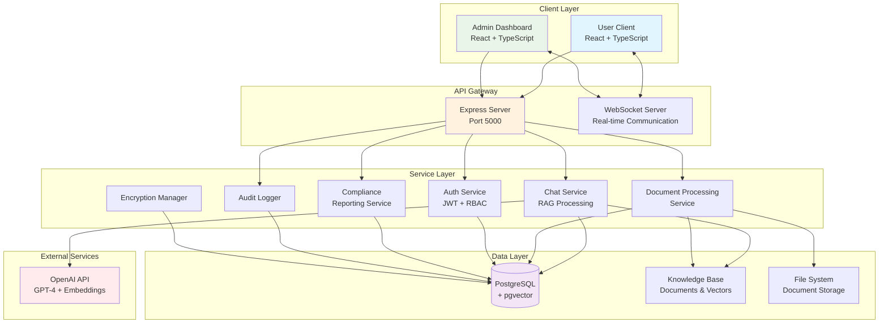
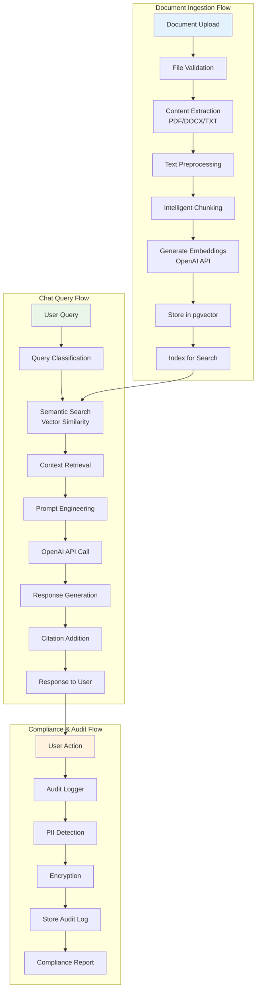
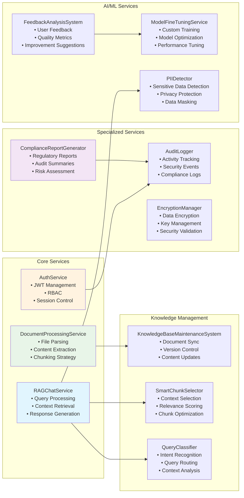
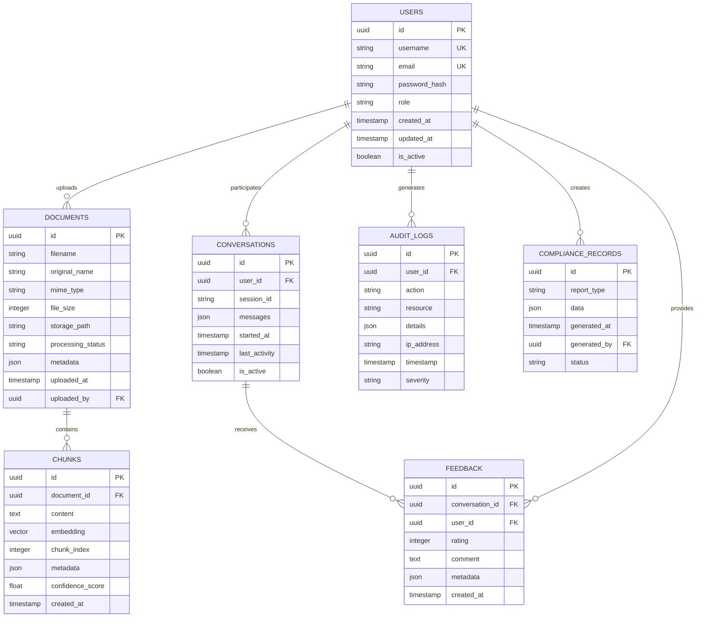
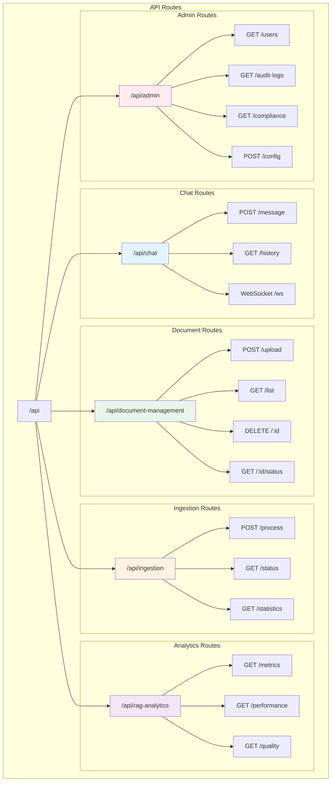
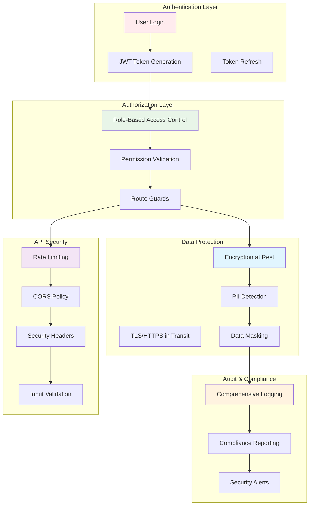
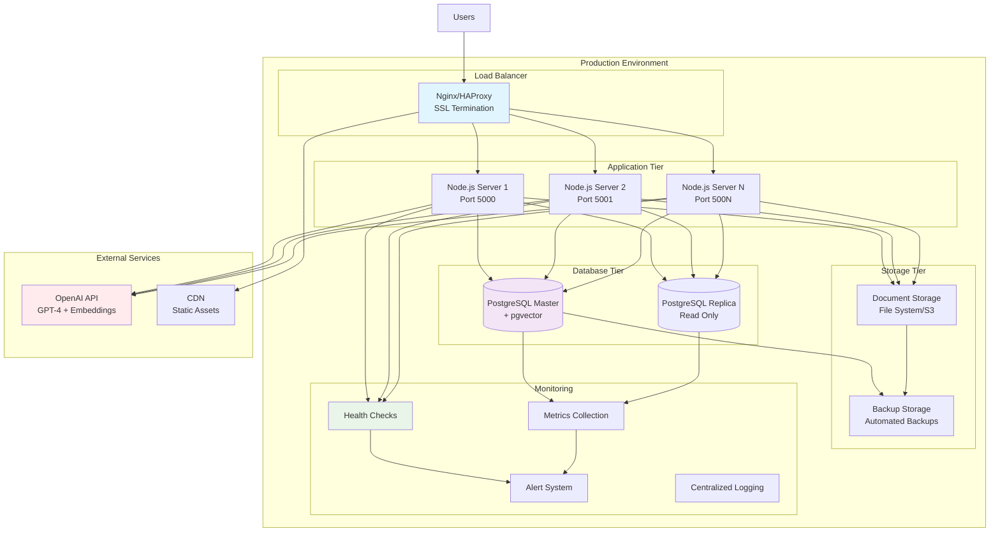
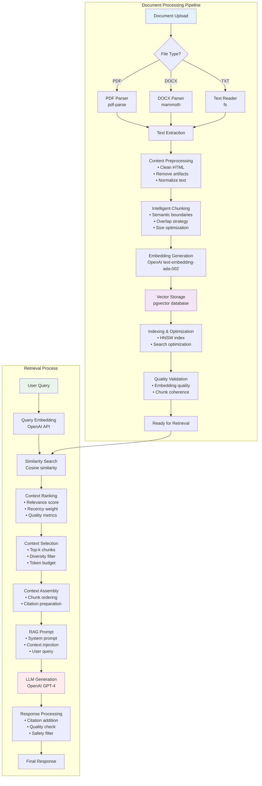

# Fund Management Chatbot - Mermaid Architecture Charts

## 1. High-Level System Architecture

## 2. Data Flow Architecture

## 3. Service Component Architecture

## 4. Database Schema Architecture

## 5. API Route Architecture

## 6. Security Architecture

## 7. Deployment Architecture

## 8. Knowledge Base Processing Flow

These Mermaid charts provide a comprehensive visual representation of your fund management chatbot architecture, covering all major components, data flows, and system interactions.
